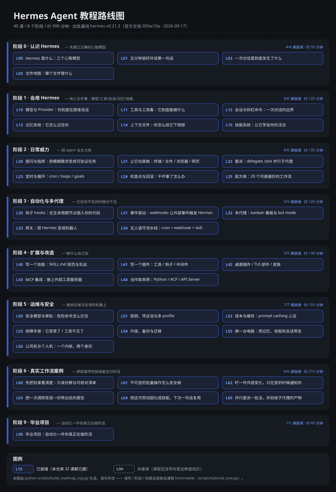

# Hermes Agent 初学者教程

> 从「装好了但不知道干什么」到「知道自己在指挥什么」的**可考证、可自维护、可回滚**教程系统。

[](https://mt-yu.github.io/HermesUsage/)
[](https://github.com/mt-yu/HermesUsage/actions/workflows/ci.yml)
[-blue)](#学习路线图)
[](sources/README.md)
[](scripts/check.py)

---

## 30 秒：先建立三个正确的心智模型

大部分人用不好 Hermes，不是不会敲命令，而是**模型错了**。先记住这三句：

**① Hermes 不是一个更聪明的聊天框，而是一个「会用工具的循环」。**
你给它一句话，它自己决定要不要读文件、跑命令、搜网页，跑完把结果塞回上下文，再想下一步，
直到它认为任务完成。所以你的提问质量 = 它能否自己验证结果。[[官方文档]](https://hermes-agent.nousresearch.com/docs/developer-guide/agent-loop)

**② 真正让 Hermes 比昨天更强的，是「技能 + 记忆」，不是换模型。**
技能（Skills）是可复用的操作说明，按需加载；记忆（MEMORY.md / USER.md）是跨会话的事实。
这两样是它「自我改进」的全部秘密。[[官方文档]](https://hermes-agent.nousresearch.com/docs/user-guide/features/skills)

**③ 同一个 agent，换一层壳就是另一个产品。**
终端 CLI、TUI、桌面 App、Telegram/Slack 机器人、IDE（ACP）、OpenAI 兼容 API —— 内核是同一套。
所以学会一个界面 ≠ 学会 Hermes，学会**内核**才是。[[官方文档]](https://hermes-agent.nousresearch.com/docs/user-guide/features/overview)

---

## 我该从哪开始？

| 你的情况 | 从这里开始 | 预计时间 |
|---|---|---|
| 还没装，就想先跑起来 | [L01 五分钟装上](./lessons/00-orient/) → `hermes setup` | 15 分钟 |
| 装好了，但只会问“你好” | [L02 一次对话里到底发生了什么](./lessons/00-orient/) | 20 分钟 |
| 想让它真的替你干活 | 直接进 [阶段 1 核心五件事](#阶段-1--会用-hermes核心五件事) | 2 小时 |
| 想自动化 / 做成机器人 | 阶段 0-1 走完再进 [阶段 3 自动化](#阶段-3--自动化与多代理进阶) | 3 小时 |
| 想给它加新能力（写技能/插件） | [阶段 4 扩展](#阶段-4--扩展与改造进阶) | 3 小时 |
| 只想知道这仓库咋用 | 跳到 [用这个仓库的命令](#用这个仓库的命令) | 1 分钟 |

**给急性子的一条忠告**（官方 Quickstart 的原话）：
> 如果 Hermes 连一次正常对话都完不成，就别急着加功能。先让一次干净的对话跑通，
> 再加 gateway、cron、skills、voice、routing。
> —— [Quickstart](https://hermes-agent.nousresearch.com/docs/getting-started/quickstart)

---

## 学习路线图



> 这张图由 `python scripts/build_roadmap_svg.py` 从课程 frontmatter 生成（课号、阶段名、时长都取自课程本身）。
> **别手改 `docs/roadmap.svg`** —— 改了课程就重跑脚本；`python scripts/check.py` 会校验它是否同步。
> 想在浏览器里点着看：站点有交互式学习地图 <https://mt-yu.github.io/HermesUsage/map.html>。

完整课程清单（含每课耗时与标签）：**[llms.txt](llms.txt)**（机器可读）
进度打勾表：**[progress/checklist.md](progress/checklist.md)**

---

## 现在就能做的第一步（5 分钟）

```bash
# 1) 看它是否已经装好（本机版本）
hermes --version

# 2) 只问一句、不进入交互界面
hermes chat -q "用三句话说明你能替我做什么，并各举一个例子"

# 3) 进入交互界面，让它做一件可验证的事
hermes
#   ❯ 看一下我当前目录里有哪些文件，告诉我哪个像是主入口文件
```

**成功的标志**（官方 Quickstart 的验收清单）：

- [ ] 启动横幅里显示了你的模型和 provider
- [ ] Hermes 正常回复，没有报错
- [ ] 它**用了工具**（读文件 / 跑终端 / 搜网页）
- [ ] 对话能连续进行不止一轮

还没装？见 [官方安装页](https://hermes-agent.nousresearch.com/docs/getting-started/installation)，
Windows 原生的坑见 [Windows 原生指南](https://hermes-agent.nousresearch.com/docs/user-guide/windows-native)。

---

## 用这个仓库的命令

```bash
python scripts/progress.py                 # 我学到哪了？下一课学什么？
python scripts/progress.py next

python scripts/verify.py                   # 内容质量门禁（改完课程必跑）
python scripts/build_index.py              # 重建 llms.txt 索引
python scripts/build_map.py                # 重建可视化学习地图 docs/learning-map.html
python scripts/build_site.py               # 重建静态站点 site/（前端改动后必跑）

python scripts/sync_sources.py --check     # 官方文档有没有改版（出处漂移检测）
python scripts/sync_sources.py             # 同步官方文档快照
python scripts/drift_watch.py --dry-run    # 漂移哨兵：有漂移就（可选）自动开 GitHub issue
python scripts/check_links_external.py     # 95 条官方外链存活检测（ok/blocked/broken/network，不进 CI）

python scripts/journal.py log              # 我这段时间做了什么（含 git 历史）
python scripts/journal.py commit --kind session --title "完成 L01" --scope L01
python scripts/journal.py rollback --list  # 想回滚时先看有哪些目标
```

> 学完一课就打卡 + 归档，是这套教程最推荐的用法 —— 它让“我学过”变成“我留下了痕迹”，
> 也让任何一次改坏的内容都能精确回滚。规则见 [CONTRIBUTING.md](CONTRIBUTING.md)。

---

## 在线看 / 本地看（交互站点）

课程除了 Markdown 原文，还有一份**可搜索、带进度打卡、出处可点开核对**的静态站点：

**在线看** → <https://mt-yu.github.io/HermesUsage/>（GitHub Pages，每次 push 到 `main` 由
[`.github/workflows/pages.yml`](.github/workflows/pages.yml) 自动重建）

**本地看**：

```bash
python -m pip install -r requirements.txt   # PyYAML + Markdown，都是纯 Python
python scripts/serve.py --open              # 构建并打开 http://127.0.0.1:8000/
```

站点能力：按阶段浏览 43 课、全站搜索（`Ctrl+K`，支持中文）、进度打勾与导出/导入 JSON、
练习打勾（与课程完成分开记）、学习地图与常见错误合集两个聚合页、学习报告导出（markdown）、
[**设计对比**](https://mt-yu.github.io/HermesUsage/design.html)（10 套 UI 方案 × 10 个维度的评分矩阵 + 落地令牌表）、
课间 `←/→` 键盘导航、8 小节目录跳转、代码块一键复制、主题三态（跟随系统 / 亮 / 暗，首帧不闪白）、
顶栏与页脚各一枚 GitHub 标识（内联 SVG，点开即到仓库源码，离线版里也在）、
`src:…` 出处徽标悬停显示官方版本与快照哈希（共 95 条官方来源）。

想一次性带走？[**单文件离线版**](https://mt-yu.github.io/HermesUsage/offline.html)（882 KB，内联样式、
页内目录、零外部资源、不需要 JS，双击即可读，也可以直接发给别人）；
学习痕迹可用首页/地图页的「导出学习报告」按钮导出 markdown。

部署（Docker / Netlify / Vercel / GitHub Pages）：见 [docs/deploy.md](docs/deploy.md)。

```bash
python scripts/check.py      # 一条命令：内容门禁 + 单元测试 + 站点自检
```

---

## 出处为什么可考证

这套教程里**每一个事实性陈述**都带 `[[src:<id>]]` 标记，可以三级反查：

```
课程里的 [[src:quickstart]]
   ↓
sources/citations.yaml     → 官方 URL + Hermes 版本 + 文档 git commit + sha256
   ↓
sources/cache/quickstart.md → 官方文档原文快照（离线可读）
   ↓
website/docs/getting-started/quickstart.md @ 05fac10a  → 官方仓库对应提交
```

所以任何读者都能自己复核，不需要相信作者：

```bash
python scripts/sync_sources.py --check   # 用你本机的官方文档源码复核哈希
git log --oneline -- sources/cache/      # 看官方文档是在哪次提交之后变的
```

- 出处基线：**hermes v0.21.3**，官方文档提交 `05fac10a`（2026-09-15），共 **89 条**来源
- 机制详解：[sources/README.md](sources/README.md)

---

## 这个仓库是怎么维护的（AI 可自学习 / 可扩展）

三条设计不是口号，是能被脚本执行的规则：

| 目标 | 落地机制 |
|---|---|
| AI 能自己接手维护 | [`.hermes.md`](.hermes.md) 项目宪章（Hermes 在任何子目录都会自动加载它），写明规范、门禁、标准动作、已知坑 |
| AI 知道自己改得对不对 | [`scripts/verify.py`](scripts/verify.py) 12 条硬规则：引用是否可解析、8 小节是否齐全、前置是否可点击、索引是否同步、快照哈希是否一致…… |
| AI / 你都能一次读全目录 | [`llms.txt`](llms.txt) 机器可读索引（沿用 Hermes 官方文档自己的做法） |
| 每次改动可回滚 | `journal/` 一记录一提交 + 阶段 tag，见 [`scripts/journal.py`](scripts/journal.py) |
| 能力可扩展 | [`.hermes/skills/`](.hermes/skills/) 项目技能：写课程、归档会话、前端渲染层、文档漂移复核、发布与版本（`hermes skills trust .` 后生效） |

**目录结构**

```
lessons/          课程正文（00-orient → 06-capstone）
sources/          出处体系：registry.yaml(人工) + cache/ + citations.yaml(自动)
scripts/          门禁、索引、出处同步、归档、进度、发布、站点构建
web/              站点前端源码（模板 / CSS / 原生 ES 模块；无 npm 依赖）
tests/            Python 单测（unittest）与前端单测（tests/js，node --test）
site/             站点构建产物（由 build_site.py 生成，不进 git）
dist/             发布资产与构建回执（由 release.py 生成，不进 git）
CHANGELOG.md      更新日志（由 release.py 从 git 提交记录生成，禁止手改）
templates/        课程 / 归档模板（= 校验规范的可读版本）
journal/          每次对话与阶段的自我总结（倒序索引）
progress/         学习者打勾清单（个人状态不进 git）
.hermes/skills/   项目自带技能
.hermes.md        项目宪章（Hermes 自动注入）
```

---

## 版本与发布

每个阶段收尾打一个注释 tag（`v<主>.<次>-<slug>`），**推 tag 就是发布**：
`.github/workflows/release.yml` 会跑一次全量检查，然后由
[`scripts/release.py`](scripts/release.py) 走 REST API 建一条 GitHub Release —
说明按提交前缀归类生成，资产是该 tag 下站点的**确定性 zip** + `SHA256SUMS`
（同一棵树在任何机器打包，字节都相同，可被 `sha256sum -c` 校验）。

- 看**每个版本改了什么**：[CHANGELOG.md](CHANGELOG.md)（Keep a Changelog 格式，倒序）
- 看**下载与逐版对照**：<https://github.com/mt-yu/HermesUsage/releases>
- 规范、校验、回滚、排障：[docs/releases.md](docs/releases.md)

发布不是「网页上点一下」：`python scripts/release.py notes --tag <tag>` 可离线重放说明，
`python scripts/release.py audit --check` 会把本地应有的每条 release 与远端逐条对账。

---

## 贡献

人和 AI 用同一套流程：改内容 → `verify.py` 全绿 → `journal.py commit`。见 [CONTRIBUTING.md](CONTRIBUTING.md)。
许可：内容 [CC BY 4.0](LICENSE)，代码 MIT，引用的官方文档内容归属上游（详见 [LICENSE](LICENSE)）。
